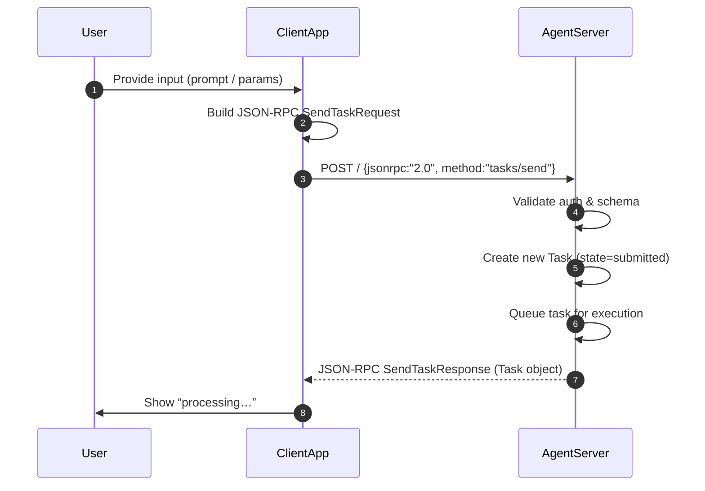
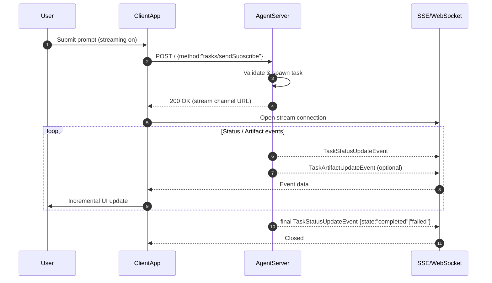
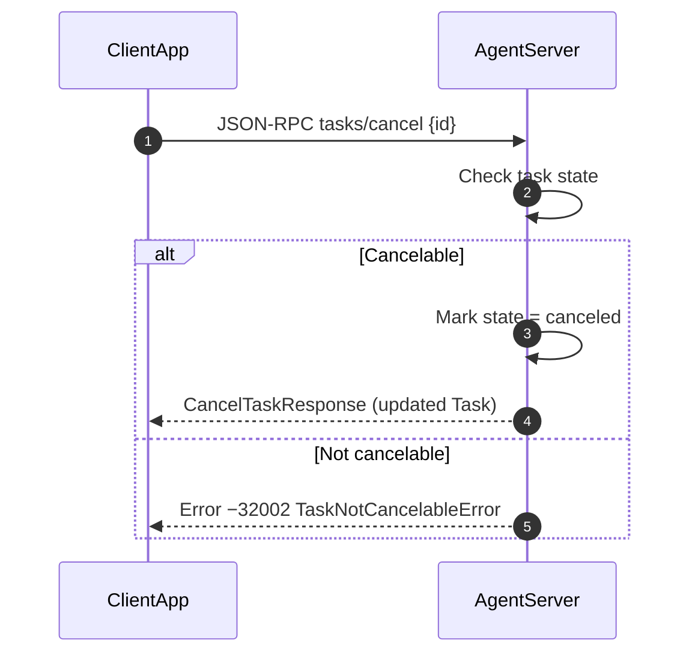
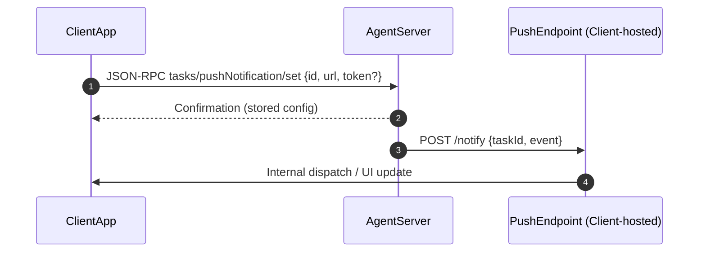

# A2A Protocol Product Requirements Document (PRD)

---

## 🔹 Bullet‑point specification (recap)

- **AgentCard**
  - `name`, `url`, `version` — required
  - `description`, `provider`, `documentationUrl` — optional
  - `capabilities` → see below
  - `authentication` → AgentAuthentication (optional)
  - `defaultInputModes`, `defaultOutputModes` (default: ["text"])
  - `skills` → array of AgentSkill (at least one)
- **AgentCapabilities**
  - `streaming` (bool, default false)
  - `pushNotifications` (bool, default false)
  - `stateTransitionHistory` (bool, default false)
- **AgentAuthentication / AuthenticationInfo**
  - `schemes` — array of auth scheme strings (e.g. "Bearer", "Basic", "None")
  - `credentials` — token / key / null
- **AgentSkill**
  - `id`, `name` (required)
  - `description`, `tags`, `examples`, `inputModes`, `outputModes` (optional)
- **Task lifecycle**
  1. submitted
  2. working
  3. input‑required
  4. completed / failed / canceled
- **Core JSON‑RPC methods**
  - `tasks/send` → creates/updates a task (sync)
  - `tasks/sendSubscribe` → same as above but streams status/artifact events
  - `tasks/get` → retrieve current state/artifacts/history
  - `tasks/cancel` → attempt to cancel
  - `tasks/pushNotification/set|get`
  - `tasks/resubscribe` → re‑open stream after reconnect
- **Artifacts & Parts**
  - Artifact = list of Part objects (text, file, data)
  - Each Part may have metadata; artifacts support chunked (append, lastChunk) uploads
- **Errors**
  - JSON‑RPC standard (−32600, −32601, −32602, −32603, −32700)
  - Domain‑specific:
    - TaskNotFoundError (−32001)
    - TaskNotCancelableError (−32002)
    - PushNotificationNotSupportedError (−32003)
    - UnsupportedOperationError (−32004)

---

## 🔹 Mermaid sequence diagrams

Copy the fenced blocks directly into any Mermaid‑enabled editor or markdown viewer.

### 1️⃣ tasks/send – synchronous request/response



---

### 2️⃣ tasks/sendSubscribe – streaming (Server‑Sent Events / WebSocket)



---

### 3️⃣ tasks/get – poll for an existing task

```mermaid
sequenceDiagram
    autonumber
    participant ClientApp
    participant Agent as AgentServer

    ClientApp->>Agent: JSON‑RPC tasks/get {id, historyLength?}
    Agent->>Agent: Lookup task; slice history if requested
    Agent-->>ClientApp: JSON‑RPC response (Task) OR error −32001
```

---

### 4️⃣ tasks/cancel – attempt cancellation



---

### 5️⃣ Push‑notification workflow (tasks/pushNotification/set)



---

### 6️⃣ tasks/resubscribe – re‑open a lost stream

```mermaid
sequenceDiagram
    autonumber
    participant ClientApp
    participant Agent as AgentServer
    participant Stream as SSE/WebSocket

    ClientApp note over ClientApp: Original stream dropped (network)
    ClientApp->>Agent: JSON‑RPC tasks/resubscribe {id, historyLength?}
    Agent-->>ClientApp: 200 OK with new stream URL
    ClientApp->>Stream: Connect
    loop Events after resubscription
        Agent-->>Stream: TaskStatusUpdateEvent / TaskArtifactUpdateEvent
    end
```

---

## 📑 How to use these snippets
1. Paste the bullet list and Mermaid blocks into a .md file.
2. Any IDE / docs tool that supports Mermaid (VS Code preview, GitHub, Obsidian, etc.) will auto‑render the diagrams.
3. Adjust participant labels or add extra steps as your implementation evolves.

---

Need more diagrams (e.g. authentication handshake) or a different visual style? — Just let me know!
