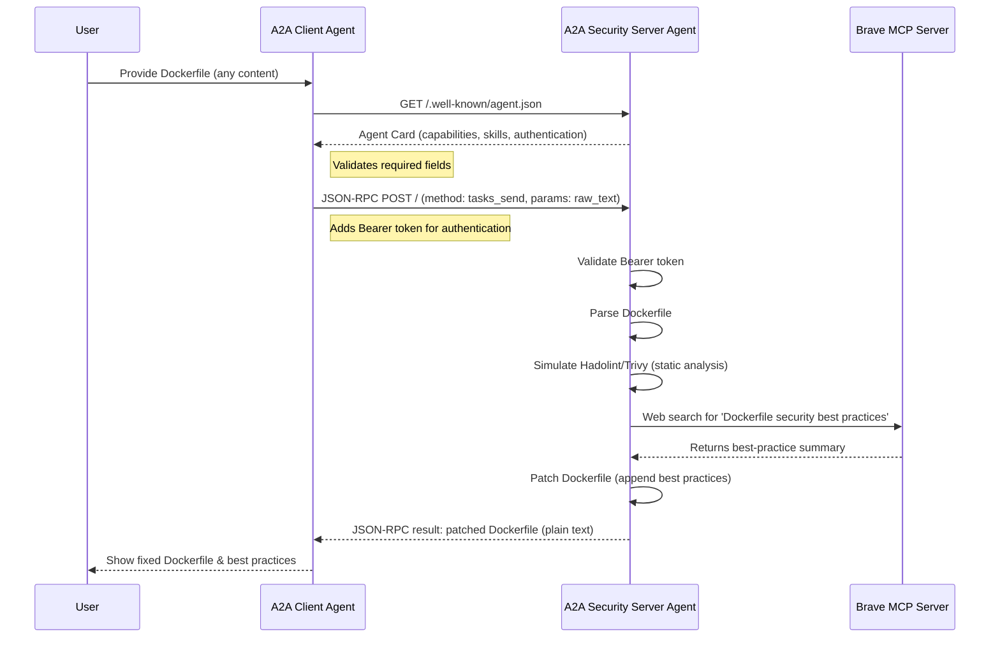

<p align="center">
  
</p>

# A2A + MCP Docker Security Demo

## Overview
This demo showcases agent-to-agent (A2A) delegation using Google’s A2A protocol and the Model-Context Protocol (MCP). A coding client agent submits a Dockerfile (or docker-compose YAML) for security review. The security server agent analyzes, hardens, and returns a patched config using static tools (Hadolint, Trivy) and live best-practice lookup (Brave/Playwright).

---

## Prerequisites
- **Docker & Docker Compose** (for all services)
- **Node.js** (for MCP server, v16+ recommended)
- **Python 3.8+**
- **npx** (comes with Node.js)
- **Brave API Key** ([get yours here](https://search.brave.com/settings))

---

## Environment Setup
1. **Copy the example env file:**
   ```sh
   cp .env.example .env
   ```
2. **Fill out all required values in `.env`:**
   - `BRAVE_API_KEY` – Your Brave Search API key
   - `LOGFIRE_TOKEN` – For structured logging (see Logfire docs or use a placeholder for local)
   - `A2A_BEARER_TOKEN` – Any strong random string (used for agent-to-agent authentication)
   - `BRAVE_MCP_SERVER_URL` – Usually `http://host.docker.internal:3000`
   - (Optional) `A2A_SERVER_URL`, `PYTHON_ENV` as needed
3. **Never commit your real `.env`!** Only `.env.example` should be shared.

---

## First Run Checklist
1. **Clone the repo:**
   ```sh
git clone <repo-url>
cd <repo-directory>
```
2. **Prepare your Dockerfile for testing:**
   - Place it at `shared/sample.Dockerfile` or update the path as needed.
3. **Start the Brave MCP server:**
   ```sh
   npx -y @modelcontextprotocol/server-brave-search
   ```
   - Leave this terminal running.
4. **Build and start all services:**
   ```sh
   docker compose up --build
   ```
5. **Submit a Dockerfile for hardening:**
   ```sh
   docker compose run client --dockerfile /app/shared/sample.Dockerfile
   ```
   (Adjust path if your Dockerfile is elsewhere.)

---

## Troubleshooting
- **Dockerfile not found:** Ensure the path exists inside the client container.
- **API key errors:** Check your `.env` and MCP server status.
- **Port conflicts:** Make sure ports 3000 (MCP) and 8080 (server) are available.
- **Logs:** Use `docker compose logs` or Logfire for structured logs.
- **Networking:** If you’re not on Docker Desktop, you may need to adjust `host.docker.internal`.

---

## Security Notes
- **Never commit `.env` or real secrets.**
- **Bearer token is for dev/demo.** Change it for production!
- **All logs are structured JSON via Logfire.**
- **Containers run as non-root and drop unneeded Linux capabilities.**

---

## Sample Output
A successful run will output something like:
```
FROM python:3.12-slim
RUN pip install ...

# Hardened by server agent
# Here are some best practices for securing your Dockerfiles:
1. **Use Official Base Images** ...
...
```

---

## How to Extend
- **Add new MCP tools:** Edit `mcp.json` and add new tool configs.
- **Change static checks:** Update `server/agent.py` logic.
- **Plug in other best-practice sources:** Modify the MCP integration or add new web search endpoints.

---

## A2A Protocol Flow (Detailed)


**A2A Protocol Details:**
- Agent Card validation ensures the server is a compliant A2A agent.
- All requests use Bearer authentication.
- Dockerfile content is never validated on the client—sent as-is.
- The server response is always a single text blob: the fixed Dockerfile with appended best practices.
- Brave MCP provides dynamic, up-to-date best-practice content.

## Features
- Cross-agent task delegation using A2A protocol
- MCP tool for Dockerfile analysis and hardening
- Static and dynamic security checks
- JSON diff and issue reporting
- Full Docker-based reproducibility

## Project Structure
```
a2a-docker-demo/
├── client/
│   ├── agent.py
│   ├── main.py
│   └── Dockerfile
├── server/
│   ├── agent.py
│   ├── main.py
│   └── Dockerfile
├── shared/
│   └── models.py
├── docker-compose.yml
├── requirements.txt
├── README.md
```

## Quick Start

### 1. Clone and Set Up
```sh
git clone <repo-url>
cd <repo-directory>
cp .env.example .env
```
Edit `.env` and fill in required values:
- `BRAVE_API_KEY` (get from Brave Search)
- `LOGFIRE_TOKEN` (optional for local, required for Logfire)
- `A2A_BEARER_TOKEN` (any strong string for dev/demo)
- `BRAVE_MCP_SERVER_URL` (usually `http://host.docker.internal:3000`)

### 2. Prepare Your Dockerfile
- Place your Dockerfile at `shared/sample.Dockerfile` (or adjust the path as needed).

### 3. Start the Brave MCP Server
```sh
npx -y @modelcontextprotocol/server-brave-search
```
Leave this terminal running.

### 4. Build and Start All Services
```sh
docker compose up --build
```

### 5. Run the Client to Submit a Dockerfile
```sh
docker compose run client --dockerfile /app/shared/sample.Dockerfile
```
Replace the path if your Dockerfile is elsewhere.

---

## Running the Client Standalone (Python)

You can run the Python client directly (outside Docker):
```sh
cd client
pip install -r ../requirements.txt
python main.py --dockerfile ../shared/sample.Dockerfile --server-url http://localhost:8080
```
Adjust the `--dockerfile` and `--server-url` as needed.

---

## Running All Tests

From the project root, run:
```sh
bash run_all_tests.sh
```
This will execute all Python and shell-based tests. Ensure your `.env` is set up and required services are running (see above).

---

## Environment Variables for local test enveironment copy these into your .env file
- `BRAVE_API_KEY` (required for Brave MCP server; set in `.env`)
- `LOGFIRE_TOKEN` (optional, for structured logging)
- `A2A_BEARER_TOKEN` (required for agent auth; just generate any random string, e.g., 32+ characters)
- `BRAVE_MCP_SERVER_URL` (URL for MCP server)
- `A2A_SERVER_URL` (optional, override for local testing)
- `PYTHON_ENV` (optional, e.g., development)
- `PYTHONUNBUFFERED=1` (default for logs)
- `MCP_SERVER_PORT=3000` (Brave MCP server)

---

## Example .env File
Copy `.env.example` to `.env` and fill in your real values. Example:

```ini
# .env.example for A2A + MCP Docker Security Demo
# Copy this file to .env and fill in your real values

# Logfire (structured logging/observability)
LOGFIRE_TOKEN=your_logfire_write_token_here

# A2A Bearer token (for client/server auth)
A2A_BEARER_TOKEN=your_a2a_bearer_token_here  # Any random string, e.g. 32+ characters

# Brave MCP (web search for best practices)
BRAVE_API_KEY=your_brave_api_key_here
BRAVE_MCP_SERVER_URL=http://host.docker.internal:3000

# (Optional) Server URL override (for local testing)
A2A_SERVER_URL=http://host.docker.internal:8080

# (Optional) Client/Server environment
PYTHON_ENV=development
```

Reference this section when setting up your environment.

---

## Troubleshooting
- **Dockerfile not found:** Ensure the path exists inside the client container.
- **API key errors:** Check your `.env` and MCP server status.
- **Port conflicts:** Make sure ports 3000 (MCP) and 8080 (server) are available.
- **Logs:** Use `docker compose logs` or Logfire for structured logs.
- **If the MCP server is not reachable:** Ensure you started it with `npx -y @modelcontextprotocol/server-brave-search` and `.env` is correct.
- **If you change `.env`:** Restart both the MCP server and all Docker containers.

---

## Project Structure
```
a2a-docker-demo/
├── client/
│   ├── agent.py
│   ├── main.py
│   └── Dockerfile
├── server/
│   ├── agent.py
│   ├── main.py
│   └── Dockerfile
├── shared/
│   └── models.py
├── docker-compose.yml
├── requirements.txt
├── README.md
```

---

## How to Extend
- **Add new MCP tools:** Edit `mcp.json` and add new tool configs.
- **Change static checks:** Update `server/agent.py` logic.
- **Plug in other best-practice sources:** Modify the MCP integration or add new web search endpoints.

---

## CI/CD
- Add your preferred pipeline to automate tests (see `.github/workflows/` if present)

---

## Security & Logging
- All logs use structured JSON format (see Logfire integration)
- Containers run as non-root, drop unneeded Linux capabilities

---

For more details, see the PRD and specs in this repo.

---

## License

This project is licensed under the MIT License. See the [LICENSE](LICENSE) file for details.

## TODO
- [ ] When updating Markdown checklists for A2A compliance, always use green check marks (✅) to indicate completed items, not just [x]. This applies to task lists in a2a-task.md and similar files.

## Environment Variables
- `BRAVE_API_KEY` (required for Brave MCP server; set in `.env`)
- `PYTHONUNBUFFERED=1` (default for logs)
- `MCP_SERVER_PORT=3000` (Brave MCP server)

## Endpoints
- **Server (Security Agent):**
  - `POST /a2a/tasks/send` — Analyze and harden Dockerfile
  - `GET /.well-known/agent.json` — Agent Card

## Testing
- End-to-end: Client submits Dockerfile, server returns patched version and JSON diff
- Latency target: ≤ 20s round-trip
- ≥80% high/critical issues resolved (simulated)

## Sample Dockerfile
Place a file like this at `shared/sample.Dockerfile`:
```
FROM python:3.8
ADD . /app
RUN pip install -r requirements.txt  # Use only the root requirements.txt for all dependencies
CMD ["python", "main.py"]
```

## Troubleshooting
- If the MCP server is not reachable, ensure you have started it with `npx -y @modelcontextprotocol/server-brave-search` and that your `.env` has the correct API key and BRAVE_MCP_SERVER_URL.
- For Docker containers to access the MCP server running on your host, use `http://host.docker.internal:3000` as the server URL in `.env`.
- If you see connection errors, check that the MCP server terminal shows it is running and listening on port 3000.
- If you change `.env`, restart both the MCP server and your Docker containers.

## CI/CD
- Add your preferred pipeline to automate tests (see `.github/workflows/` if present)

## Security & Logging
- All logs use structured JSON format (see Logfire integration)
- Containers run as non-root, drop unneeded Linux capabilities

---

For more details, see the PRD and specs in this repo.

---

## License

This project is licensed under the MIT License. See the [LICENSE](LICENSE) file for details.
